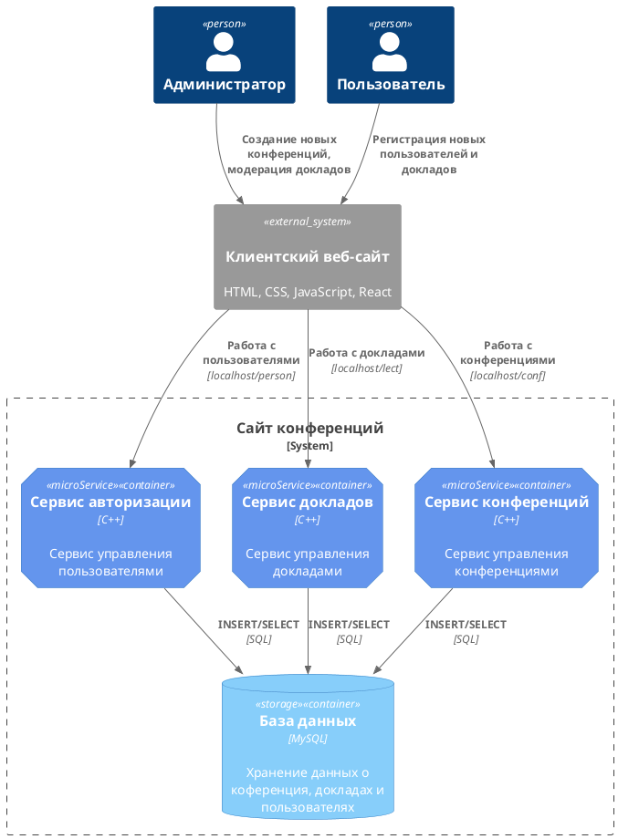
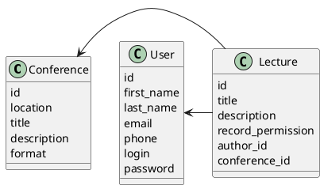

# Компонентная архитектура
<!-- Состав и взаимосвязи компонентов системы между собой и внешними системами с указанием протоколов, ключевые технологии, используемые для реализации компонентов.
Диаграмма контейнеров C4 и текстовое описание. 
-->
## Компонентная диаграмма

## Список компонентов  

### Сервис авторизации
**API**:
-	Создание нового пользователя
      - входные параметры: login, пароль, имя, фамилия, email, номер телефона
      - выходные параметры: отсутствуют
-	Поиск пользователя по логину
     - входные параметры: login
     - выходные параметры: имя, фамилия, email, номер телефона
-	Поиск пользователя по маске имени и фамилии
     - входные параметры: маска фамилии, маска имени
     - выходные параметры: login, имя, фамилия, email, номер телефона

### Сервис докладов
**API**:
- Создание доклада
  - Входные параметры: название доклада, аннотация, разрешение на запись доклада, идентификатор автора, идентификатор конференции
  - Выходыне параметры: идентификатор доклада
- Получение списка всех докладов
  - Входные параметры: отсутствуют
  - Выходные параметры: массив докладов, где для каждого указаны его идентификатор, название, анотация, разрешение на запись доклада, идентификатор автора и идентификатор конференции

### Сервис конференций
**API**:
- Добавление доклада в конференцию
  - Входные параметры: идентификатор конференции, идентификатор доклада
  - Выходные параметры: отсутсвуют
- Получение списка всех докладов конференции
  - Входные параметры: идентификатор конференции
  - Выходные параметры: массив докладов, читаемых в рамках указанной конференции, где для каждого указаны его идентификатор, название, анотация, разрешение на запись доклада, идентификатор автора и идентификатор конференции

### Модель данных
