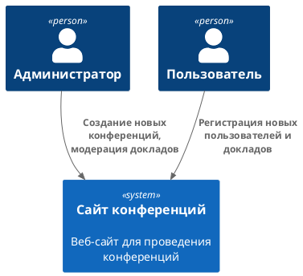

# Контекст решения
<!-- Окружение системы (роли, участники, внешние системы) и связи системы с ним. Диаграмма контекста C4 и текстовое описание. 
-->

## Назначение систем
|Система| Описание|
|-------|---------|
| Сайт блогов | Веб-интерфейс, обеспечивающий доступ к информации о проводимых конференциях. Бэкенд сервиса реализован в виде микросервисной архитектуры |

